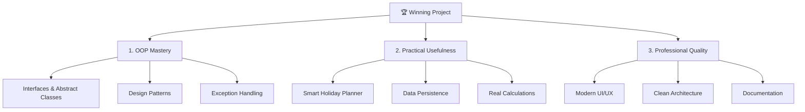

# 🏆 Attendance Eligibility Management System — Feature Plan & Roadmap

## Current State Analysis

The project has a **solid foundation** with these existing features:

| What Exists | Status |
|---|---|
| `Student`, `Subject`, `AttendanceRecord` data models | ✅ Working |
| `AttendanceCalculator` — eligibility, safe bunks, recovery classes, leave prediction | ✅ Working |
| `WeeklySchedule` — day-wise timetable mapping | ✅ Working |
| Swing GUI with dashboard, subject cards, progress bars | ✅ Working |
| `PredictionDialog` — leave impact simulation | ✅ Working |
| `ManageHolidaysDialog`, `SemesterSettingsDialog` | ✅ Working |
| Data Persistence (save/load between sessions) | ❌ Missing |
| Modern, polished UI design | ❌ Basic |
| OOP best practices (interfaces, abstract classes, design patterns) | ❌ Minimal |
| Remove/Edit subject capability | ❌ Missing |
| Holiday planner ("how many days can I skip?") | ❌ Missing |

---

## 🎯 What Will Make This Project WIN

For a Java PBL project, judges evaluate on **3 pillars**:



---

## 📋 Proposed Feature Roadmap

### Phase 1: 🏗️ Architecture & OOP Showcase (Foundation)

> [!IMPORTANT]
> This phase demonstrates **Java OOP mastery** — the #1 thing evaluators look for.

#### [NEW] Custom Exceptions
- `AttendanceException` (abstract base)
- `InvalidAttendanceDataException` — for invalid data entry
- `EligibilityThresholdException` — thrown when attendance drops below 75%

#### [MODIFY] Design Patterns Implementation
- **Singleton** — `DataManager` for centralized data management
- **Observer** — Dashboard auto-refreshes when any data changes
- **Strategy** — Pluggable attendance calculation strategies (75%, 80%, custom)
- **Factory** — Subject creation with validation

#### [NEW] Interfaces & Abstract Classes
- `Calculable` interface with `calculate()` method
- `Persistable` interface with `save()` / `load()` methods
- `AbstractReport` base class for different report types

---

### Phase 2: 🧠 Smart Holiday Planner (The Killer Feature)

> [!TIP]
> This is the **unique selling point** — no other project will have this!

#### The "Holiday Optimizer" Feature
Instead of just checking "can I take leave on X date?", the system will answer:

1. **"How many days can I take off?"** — Given current attendance, calculate the maximum consecutive leave days before any subject drops below 75%
2. **"Best days to skip"** — Analyze the weekly schedule to suggest which days have the least impact (skip days with fewer classes)
3. **"Weekend Extender"** — Automatically calculate how many days you can extend around weekends/holidays
4. **"Recovery Roadmap"** — If already below 75%, show a day-by-day plan: "Attend Mon, Tue, skip Wed (holiday), attend Thu..." with a projected date when you'll be back above 75%
5. **"Danger Zone Calendar"** — Visual calendar showing:
   - 🟢 Green days = safe to skip
   - 🟡 Yellow days = risky
   - 🔴 Red days = must attend

---

### Phase 3: 💾 JDBC / MySQL Persistence

#### Database Schema
```sql
CREATE DATABASE attendance_system;

-- Students table
CREATE TABLE students (
    id INT AUTO_INCREMENT PRIMARY KEY,
    name VARCHAR(100) NOT NULL,
    semester_start_date DATE,
    semester_end_date DATE
);

-- Subjects table  
CREATE TABLE subjects (
    id INT AUTO_INCREMENT PRIMARY KEY,
    student_id INT NOT NULL,
    name VARCHAR(100) NOT NULL,
    classes_per_week INT,
    FOREIGN KEY (student_id) REFERENCES students(id) ON DELETE CASCADE
);

-- Attendance records (full history!)
CREATE TABLE attendance_records (
    id INT AUTO_INCREMENT PRIMARY KEY,
    subject_id INT NOT NULL,
    record_date DATE NOT NULL,
    is_present BOOLEAN NOT NULL,
    FOREIGN KEY (subject_id) REFERENCES subjects(id) ON DELETE CASCADE
);

-- Holidays
CREATE TABLE holidays (
    id INT AUTO_INCREMENT PRIMARY KEY,
    student_id INT NOT NULL,
    holiday_date DATE NOT NULL,
    description VARCHAR(200),
    FOREIGN KEY (student_id) REFERENCES students(id) ON DELETE CASCADE
);

-- Weekly schedule
CREATE TABLE weekly_schedule (
    id INT AUTO_INCREMENT PRIMARY KEY,
    subject_id INT NOT NULL,
    day_of_week VARCHAR(10) NOT NULL,
    FOREIGN KEY (subject_id) REFERENCES subjects(id) ON DELETE CASCADE
);
```

#### [NEW] Java Implementation
- `DatabaseConfig.java` — connection URL, user, password constants
- `DatabaseManager.java` — **Singleton** pattern, connection management, auto-create tables
- CRUD methods for all entities with **PreparedStatement** (SQL injection safe)
- Auto-save on every UI action, auto-load on startup
- **Try-with-resources** for connection management

> This demonstrates: **JDBC, Singleton, PreparedStatement, Foreign Keys, Try-with-resources, SQL**

---

### Phase 4: 🎨 Modern UI Overhaul

#### Enhanced Dashboard
- **Custom color scheme** — Dark header with gradient, card-based layout with shadows
- **Animated progress bars** with smooth color transitions (green → yellow → red)
- **Status icons** — ✅ ❌ ⚠️ next to each subject
- **Overall attendance summary panel** at the top
- **Quick stats panel**: Total subjects, eligible count, at-risk count

#### New UI Panels
- **Holiday Planner Panel** — Calendar-style view with color-coded days
- **Attendance History Panel** — Scrollable table with date-wise records
- **Weekly Schedule View** — Visual timetable grid

#### Subject Card Improvements
- Edit subject (rename, change days)
- Delete subject with confirmation
- Expand/collapse attendance history
- Mini calendar showing recent attendance pattern

---

### Phase 5: 📊 Reports & Analytics

- **Summary Report Dialog** — Overall attendance status across all subjects
- **Subject Comparison Chart** — Bar chart comparing attendance percentages
- **Trend Analysis** — Is attendance improving or declining?
- **Export to text file** — Generate printable attendance report

---

## 📁 Proposed File Structure (After Implementation)

```
src/com/attendance/
├── model/
│   ├── Student.java              [MOVE from root]
│   ├── Subject.java              [MOVE from root]
│   ├── AttendanceRecord.java     [MOVE from root]
│   └── WeeklySchedule.java       [MOVE from root]
├── calculator/
│   ├── AttendanceCalculator.java  [MOVE + ENHANCE]
│   └── HolidayOptimizer.java     [NEW — the killer feature]
├── persistence/
│   └── DataManager.java          [NEW — Singleton, File I/O]
├── exception/
│   ├── AttendanceException.java   [NEW]
│   ├── InvalidAttendanceDataException.java  [NEW]
│   └── EligibilityThresholdException.java   [NEW]
├── ui/
│   ├── MainWindow.java            [MOVE + MAJOR OVERHAUL]
│   ├── PredictionDialog.java      [MOVE + ENHANCE]
│   ├── ManageHolidaysDialog.java  [MOVE + ENHANCE]
│   ├── SemesterSettingsDialog.java [MOVE]
│   ├── HolidayPlannerPanel.java   [NEW — calendar view]
│   ├── ReportDialog.java          [NEW]
│   └── UIConstants.java           [NEW — colors, fonts, dimensions]
├── observer/                      [NEW — Observer pattern]
│   ├── AttendanceObserver.java    [NEW — interface]
│   └── DashboardObserver.java     [NEW — implementation]
├── AttendanceApp.java             [ENTRY POINT]
└── Main.java                      [CLI Testing — keep for demo]
```

---

## ⚡ Implementation Priority (What to Build First)

| Priority | Feature | Why It Matters | Effort |
|---|---|---|---|
| **P0** | Holiday Optimizer + Smart Planner | Unique feature, core use case | Medium |
| **P0** | Delete/Edit Subject | Basic missing functionality | Low |
| **P1** | Data Persistence (JSON File I/O) | Shows I/O + Singleton pattern | Medium |
| **P1** | Custom Exceptions + Interfaces | OOP showcase | Low |
| **P1** | UI Polish (colors, fonts, cards) | First impressions matter | Medium |
| **P2** | Observer Pattern (auto-refresh) | Design pattern showcase | Medium |
| **P2** | Report/Export | Extra credit | Low |
| **P3** | Package reorganization | Clean architecture | Low |

---

## Verification Plan

### Manual Verification (by you, the developer)
1. **Compile & run** — `javac -d bin -sourcepath src src/com/attendance/AttendanceApp.java && java -cp bin com.attendance.AttendanceApp`
2. **Test Holiday Optimizer** — Add subjects, set semester dates, click "Plan Holiday" → verify it correctly shows max safe leave days
3. **Test Persistence** — Add a subject, close app, reopen → data should be there
4. **Test Edit/Delete** — Right-click a subject → edit name/days, delete → verify dashboard updates
5. **Test Prediction** — Plan a 5-day leave → verify percentage predictions match manual calculation

---

## User Review Required

> [!IMPORTANT]
> **Key decisions that need your input:**

1. **Package Reorganization**: Should we reorganize into sub-packages (`model/`, `ui/`, `calculator/`, etc.) or keep all files in `com.attendance`? Reorganizing looks more professional but changes all import statements.

2. **Feature Scope**: Do you want ALL phases implemented, or should we focus on Phase 1-3 first (architecture + holiday optimizer + persistence) and add UI polish later?

3. **Database vs File**: The README mentions MySQL, but for simplicity and portability (no MySQL installation needed for demo), I recommend JSON file persistence. Do you agree, or do you want actual MySQL integration?

4. **Holiday Optimizer Depth**: The "smart holiday planner" can range from simple ("max days you can skip") to complex ("optimal days calendar with color coding"). How deep should we go?

5. **Timeline**: Roughly when is this project due? This helps prioritize which features to tackle first.
