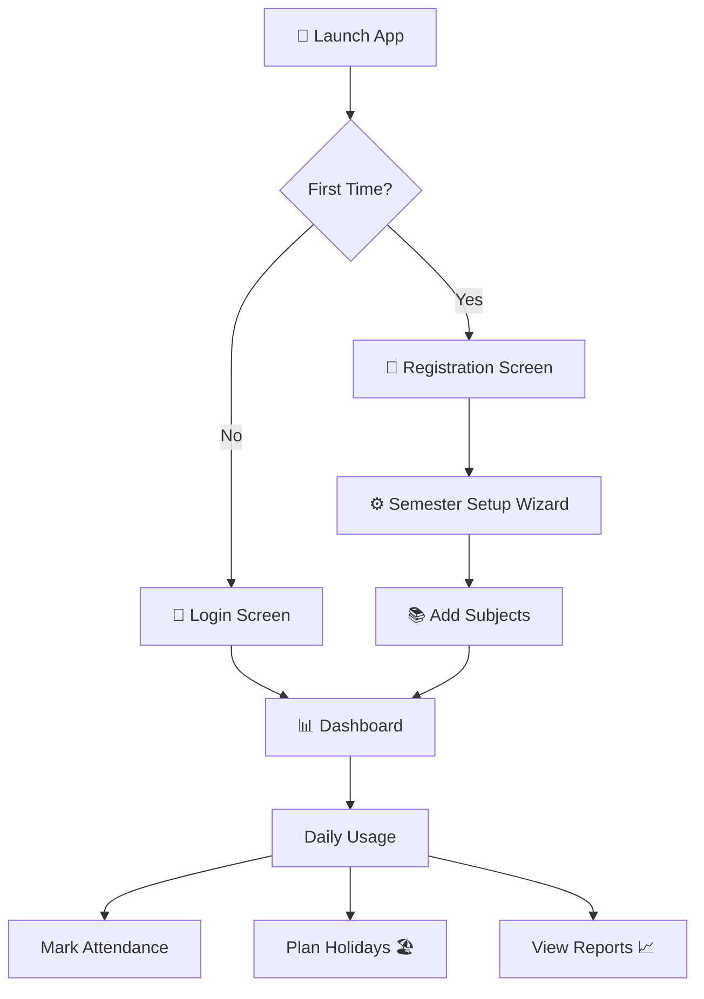

# 🎬 App Dry Run — Complete User Journey

## Flow Overview



---

## Step 1: 🚀 App Launch → Login/Register

When you open the app, you'll see a **login screen**:

```
┌──────────────────────────────────────┐
│     🎓 Attendance Manager            │
│                                      │
│  Username:  [ archit_mittal    ]     │
│  Password:  [ ••••••••         ]     │
│                                      │
│  [  Login  ]   [  Register  ]        │
│                                      │
└──────────────────────────────────────┘
```

- **New user?** → Click Register → Enter name, username, password → Account saved in MySQL
- **Returning user?** → Login → Goes straight to Dashboard with ALL your previous data loaded from DB

---

## Step 2: ⚙️ First-Time Setup Wizard (only once)

After registering, a setup wizard pops up asking **4 dates**:

```
┌──────────────────────────────────────────────┐
│    📅 Semester Configuration                  │
│                                              │
│  Semester Start:         [ 2026-01-06 ]      │
│  Mid-Sem Exams Start:    [ 2026-03-10 ]      │
│  Mid-Sem Exams End:      [ 2026-03-20 ]      │
│  Last Teaching Day:      [ 2026-05-15 ]      │
│                                              │
│  ℹ️ Classes Phase 1: Jan 6 → Mar 9           │
│  ℹ️ Mid-Sem Break: Mar 10 → Mar 20           │
│  ℹ️ Classes Phase 2: Mar 21 → May 15         │
│                                              │
│              [ Save & Continue ]              │
└──────────────────────────────────────────────┘
```

> This is saved to MySQL — you never enter it again!

---

## Step 3: 📚 Add Your Subjects

Next, you add each subject with its weekly schedule:

```
┌──────────────────────────────────────────────┐
│    📚 Add Subject                             │
│                                              │
│  Subject Name:  [ Data Structures       ]    │
│                                              │
│  Classes on which days?                       │
│  [✅] Mon  [✅] Tue  [ ] Wed                  │
│  [✅] Thu  [ ] Fri  [ ] Sat                   │
│                                              │
│  Already attended? (optional for mid-sem)     │
│  Classes Conducted: [ 20 ]                   │
│  Classes Attended:  [ 18 ]                   │
│                                              │
│        [ Save ]  [ + Add Another ]            │
└──────────────────────────────────────────────┘
```

**You enter:** Subject name + which days it has class + initial attendance (if joining mid-semester)

**Example:** You add 5 subjects → Data Structures, OS, Core Java, DBMS, Math

> All saved to MySQL instantly!

---

## Step 4: 📊 The Main Dashboard (Daily View)

After setup, you land on the **dashboard** — this is where you'll spend most of your time:

```
┌──────────────────────────────────────────────────────────────────────┐
│  🎓 Attendance Dashboard — Archit Mittal          [ ⚙️ Settings ]  │
├──────────────────────────────────────────────────────────────────────┤
│                                                                      │
│  📊 Overall: 82.3%  ✅ Eligible    │  Subjects: 5  │ At Risk: 1    │
│                                                                      │
├──────────────────────────────────────────────────────────────────────┤
│                                                                      │
│  ┌─── Data Structures ─────────────────────────────────────┐        │
│  │  18/20 (90.0%)  ██████████████████░░  ✅ SAFE           │        │
│  │  Can miss 4 more classes  │  Remaining: 28 classes       │        │
│  │  [📅 14/02] [✅ Attended] [❌ Missed]  [✏️ Edit] [🗑️]   │        │
│  └──────────────────────────────────────────────────────────┘        │
│                                                                      │
│  ┌─── Operating Systems ───────────────────────────────────┐        │
│  │  14/20 (70.0%)  ██████████████░░░░░░  ⚠️ AT RISK       │        │
│  │  Must attend next 4 classes!  │  Remaining: 22 classes   │        │
│  │  [📅 14/02] [✅ Attended] [❌ Missed]  [✏️ Edit] [🗑️]   │        │
│  └──────────────────────────────────────────────────────────┘        │
│                                                                      │
│  ┌─── Core Java ───────────────────────────────────────────┐        │
│  │  12/15 (80.0%)  ████████████████░░░░  ✅ SAFE           │        │
│  │  Can miss 2 more classes  │  Remaining: 30 classes       │        │
│  │  [📅 14/02] [✅ Attended] [❌ Missed]  [✏️ Edit] [🗑️]   │        │
│  └──────────────────────────────────────────────────────────┘        │
│                                                                      │
├──────────────────────────────────────────────────────────────────────┤
│  [ 📅 Manage Holidays ]  [ ⚙️ Semester ]  [ 🏖️ Plan Holiday ]     │
└──────────────────────────────────────────────────────────────────────┘
```

---

## Step 5: ✅ Daily Usage — Mark Attendance

**Every day after class**, you quickly mark attendance:

1. Select today's date (pre-filled)
2. Click **"Attended"** or **"Missed"** for each subject
3. Dashboard instantly updates — saved to MySQL

> This takes **5 seconds** per day!

---

## Step 6: 🏖️ The Holiday Planner (Killer Feature)

**The question every student asks: "Can I take Friday off?"**

Click **"Plan Holiday"** → Opens the Holiday Planner:

```
┌──────────────────────────────────────────────────────────────────┐
│    🏖️ Smart Holiday Planner                                      │
│                                                                  │
│  ── Option 1: Check Specific Dates ──                            │
│  Leave From: [ 2026-02-20 ]  To: [ 2026-02-24 ]                │
│  [ Check Impact ]                                                │
│                                                                  │
│  Results:                                                        │
│  ┌──────────────────────────────────────────────────────┐        │
│  │  Data Structures:  90.0% → 86.4%   ✅ Still Safe     │        │
│  │  Operating Systems: 70.0% → 63.6%  🔴 DANGER!        │        │
│  │  Core Java:        80.0% → 76.5%   ⚠️ Risky          │        │
│  │                                                       │        │
│  │  ⚠️ VERDICT: Cannot take this leave!                  │        │
│  │  OS will drop below 75%                               │        │
│  └──────────────────────────────────────────────────────┘        │
│                                                                  │
│  ── Option 2: How Many Days Can I Skip? ──                       │
│  [ Calculate Max Safe Leave ]                                    │
│                                                                  │
│  "You can safely take 3 consecutive days off                     │
│   starting from any Mon/Wed/Fri (fewest classes).                │
│   Best window: Feb 28 - Mar 2 (Sat-Mon, only 1 class missed!)"  │
│                                                                  │
│  ── Option 3: Recovery Roadmap ──                                │
│  (For OS which is below 75%)                                     │
│  "Attend next 4 OS classes (Feb 18, 20, 25, 27)                 │
│   to reach 75%. After that you can miss 1."                      │
│                                                                  │
└──────────────────────────────────────────────────────────────────┘
```

---

## Step 7: Return Visit (Next Day)

```
1. Open app → Login screen → Enter username/password
2. Dashboard loads instantly with ALL your previous data from MySQL
3. Mark today's attendance → Done!
```

**Nothing to re-enter.** Everything persists in the database.

---

## Complete Feature Summary

| Action | When | What You Enter | What You See |
|---|---|---|---|
| **Register** | Once | Name, username, password | Account created |
| **Semester Setup** | Once per semester | 4 dates | Saved to DB |
| **Add Subjects** | Once per semester | Name + class days + initial count | Subject card on dashboard |
| **Mark Attendance** | Daily (5 seconds) | Click "Attended" or "Missed" | Updated % + safe bunk count |
| **Plan Holiday** | When needed | Leave dates | Impact prediction |
| **Edit/Delete Subject** | When needed | Click edit/delete icon | Updated dashboard |
| **Add Holiday** | When needed | Holiday date | Excluded from calculations |
| **View Reports** | Anytime | Click reports | Summary of all subjects |
